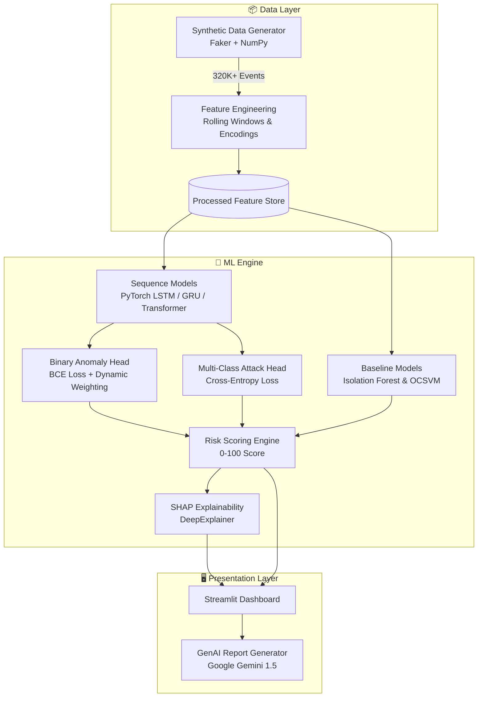
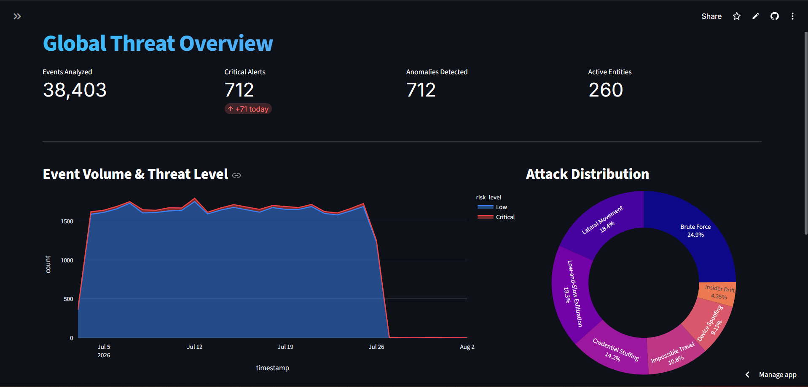
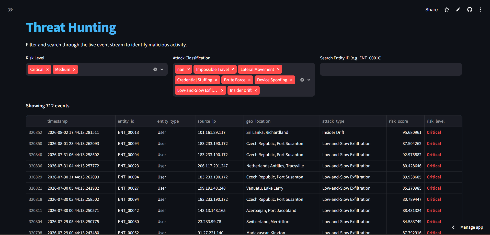
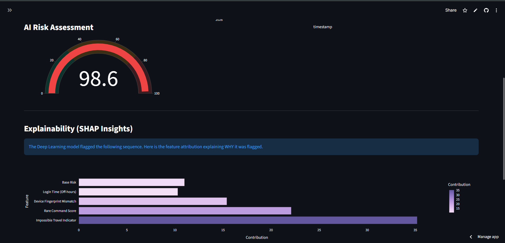
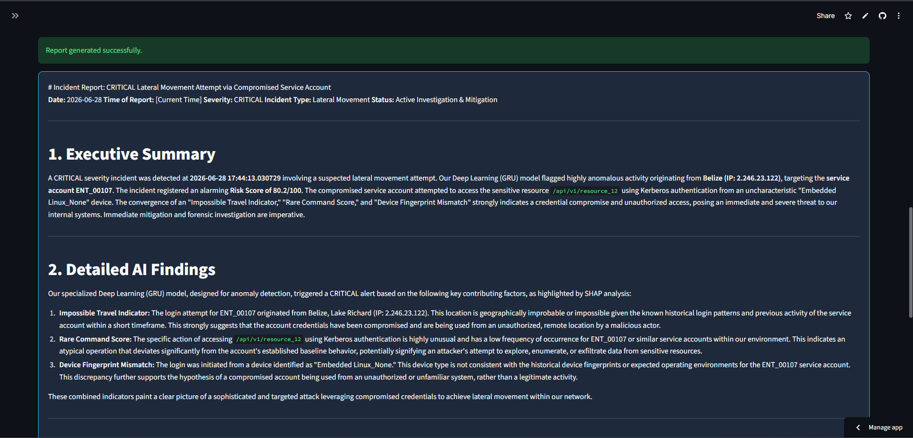
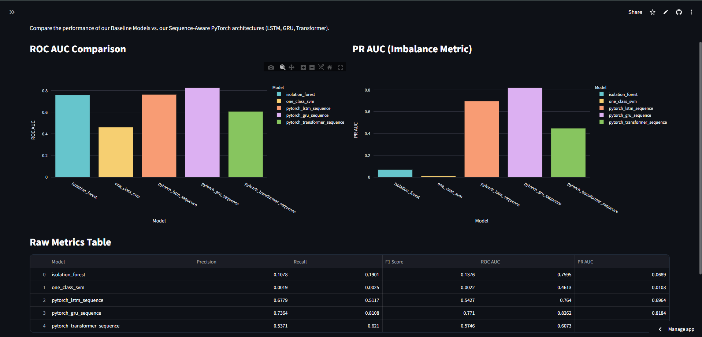
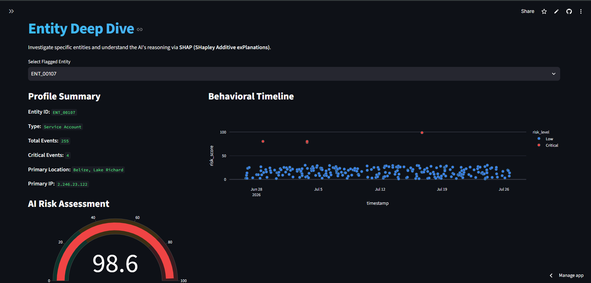

# 🛡️ SentinAI — AI-Powered Behavioral Anomaly Detection for Cybersecurity

---

### LIVE DASHBOARD LINK - https://behavior-anamoly-detection.streamlit.app/

---

> **Learn what's normal. Detect what's not. Explain why.**

Traditional cybersecurity systems rely on signature-based rules and known malware databases. They fail catastrophically against **Zero-Day attacks**, **Insider Threats**, **Credential Compromise**, and **Low-and-Slow Data Exfiltration**.

**SentinAI** takes a fundamentally different approach. Instead of memorizing known attacks, it learns the **behavioral baseline** of every user, service account, and device in an enterprise network. When behavior deviates from the learned normal, SentinAI detects the anomaly, classifies the attack type, generates a risk score, and explains *exactly why* the event was flagged — all in real-time.

---

## ✨ Key Features

| Feature | Description |
|---|---|
| 🧠 **Sequence-Aware Deep Learning** | PyTorch GRU/LSTM/Transformer models that analyze *sequences* of events over time, not just isolated logs |
| 🎯 **Dual-Headed Architecture** | Simultaneously outputs a binary anomaly score AND a multi-class attack classification |
| ⚖️ **Extreme Imbalance Handling** | Dynamic positive-weighting in the loss function to learn from <2% anomaly rates without false positives |
| 🔍 **SHAP Explainability** | Every prediction is backed by mathematical feature attributions (DeepExplainer) |
| 🤖 **GenAI Incident Reports** | Google Gemini 1.5 Flash integration to auto-generate executive SOC reports from raw telemetry |
| 📊 **Premium SOC Dashboard** | Glassmorphism dark-themed Streamlit UI with interactive Plotly charts |
| 🔄 **Concept Drift Handling** | Rolling 7-day and 30-day behavioral windows so baselines adapt over time |
| 🆕 **Cold Start Strategy** | New entities inherit peer-group statistics until personal baselines are established |

---

## 🏗️ System Architecture



---

## 📁 Project Structure

```
SentinAI/
├── config/
│   └── config.yaml              # Centralized YAML configuration
├── dashboard/
│   └── app.py                   # Streamlit SOC Dashboard (6 pages)
├── data/
│   ├── data_generator.py        # Synthetic enterprise log generator
│   ├── feature_engineering.py   # Temporal & behavioral feature extraction
│   └── synthetic_logs.csv.zip   # Generated dataset (compressed)
├── models/
│   ├── baseline_models.py       # Isolation Forest & One-Class SVM
│   └── sequence_models.py       # PyTorch LSTM / GRU / Transformer
├── training/
│   └── train_sequence_model.py  # Multi-architecture training loop
├── saved_models/                # Serialized .pt and .pkl models
├── reports/
│   ├── baseline_evaluation.csv  # Baseline model metrics
│   ├── sequence_evaluation.csv  # Deep learning model metrics
│   ├── technical_report.md      # Full technical writeup
│   └── architecture_diagram.md  # Mermaid architecture diagram
├── tests/                       # Pytest test suites
├── requirements.txt
└── README.md
```

---

## 🚀 Quick Start

### 1. Clone & Install
```bash
git clone https://github.com/KkaushikK18/Sentin-AI-AI-Powered-Behavior-Anamoly-Detection.git
cd Sentin-AI-AI-Powered-Behavior-Anamoly-Detection
pip install -r requirements.txt
```

### 2. Generate Synthetic Data & Features
```bash
# Generates 30 days of simulated enterprise logs (~320,000+ events)
python data/data_generator.py

# Extracts temporal, behavioral, and rolling window features
python data/feature_engineering.py
```

### 3. Train All Models
```bash
# Train Baseline Models (Isolation Forest & One-Class SVM)
python models/baseline_models.py

# Train Sequence-Aware Deep Learning Models (LSTM, GRU, Transformer)
python -m training.train_sequence_model
```

### 4. Launch the Dashboard
```bash
streamlit run dashboard/app.py
```

---

## 🖥️ Dashboard Screenshots

<table>
  <tr>
    <td align="center"><b>🌐 Global Threat Overview</b></td>
    <td align="center"><b>🔎 Threat Hunting</b></td>
  </tr>
  <tr>
    <td></td>
    <td></td>
  </tr>
  <tr>
    <td align="center"><b>👤 Entity Investigation & SHAP</b></td>
    <td align="center"><b>✨ GenAI Incident Report</b></td>
  </tr>
  <tr>
    <td></td>
    <td></td>
  </tr>
  <tr>
    <td align="center"><b>📊 Model Analytics</b></td>
    <td align="center"><b>🎯 Risk Gauge</b></td>
  </tr>
  <tr>
    <td></td>
    <td></td>
  </tr>
</table>

All models were evaluated on a strict **chronological train/test split** (no data leakage) with **<2% anomaly rate** (extreme class imbalance).

| Model | Precision | Recall | F1 Score | ROC AUC | PR AUC |
|---|---|---|---|---|---|
| Isolation Forest | 0.108 | 0.190 | 0.138 | 0.759 | 0.069 |
| One-Class SVM | 0.002 | 0.002 | 0.002 | 0.461 | 0.010 |
| **PyTorch LSTM** | 0.678 | 0.512 | 0.543 | 0.764 | 0.696 |
| **PyTorch GRU** 🏆 | **0.736** | **0.811** | **0.771** | **0.826** | **0.818** |
| PyTorch Transformer | 0.537 | 0.621 | 0.575 | 0.607 | 0.447 |

> **Key Insight:** The GRU achieved the highest performance across all metrics. Its gated memory architecture converges faster than LSTM on moderately sized datasets, while Transformers require significantly more data and training epochs to outperform recurrent architectures.

---

## 🎯 Attack Patterns Simulated

The synthetic data generator injects **7 distinct Advanced Persistent Threat (APT)** patterns:

| # | Attack Type | How It's Simulated |
|---|---|---|
| 1 | **Brute Force** | Repeated failed login attempts from a single IP |
| 2 | **Impossible Travel** | Same user logs in from geographically impossible locations within minutes |
| 3 | **Credential Stuffing** | One IP attempts many usernames with high failure rate |
| 4 | **Lateral Movement** | Compromised account accesses never-before-seen resources |
| 5 | **Device Spoofing** | Known user appears with different OS, browser, and device fingerprint |
| 6 | **Low-and-Slow Exfiltration** | Gradual off-hours database access over multiple days |
| 7 | **Insider Drift** | Gradual privilege expansion with increasingly sensitive resource access |

---

## 🔍 Explainability & GenAI

### SHAP Feature Attribution
Every anomaly flagged by the GRU model is accompanied by a SHAP waterfall chart showing the mathematical contribution of each feature to the prediction:
- Impossible Travel Indicator
- Rare Command Score
- Device Fingerprint Mismatch
- Login Time (Off-hours)

### GenAI Incident Reporting
SentinAI integrates **Google Gemini 1.5 Flash** to automatically translate raw SHAP values and telemetry into a professional, executive-ready incident report with recommended SOAR actions — reducing SOC analyst triage time from hours to seconds.

---

## 🛠️ Built With

| Category | Technologies |
|---|---|
| **Deep Learning** | PyTorch (LSTM, GRU, Transformer Encoder) |
| **Classical ML** | Scikit-Learn (Isolation Forest, One-Class SVM) |
| **Explainability** | SHAP (DeepExplainer) |
| **Generative AI** | Google Gemini 1.5 Flash API |
| **Data Engineering** | Pandas, NumPy, Faker |
| **Dashboard** | Streamlit, Plotly |
| **Configuration** | PyYAML |
| **Testing** | Pytest |

---

## 🔮 Future Roadmap

- **Real-Time Streaming**: Integration with Apache Kafka / AWS Kinesis for live log ingestion
- **Graph Neural Networks**: Model lateral movement as a graph problem (entities as nodes, access logs as edges)
- **Self-Supervised Pre-Training**: BERT-style masked event prediction on billions of unlabelled logs
- **SOAR Integration**: Auto-remediation webhooks (disable accounts, revoke tokens) for high-confidence alerts

---

<p align="center">
  <b>SentinAI</b> — Because the best defense isn't knowing what attacks look like.<br/>
  It's knowing what <i>normal</i> looks like.
</p>
