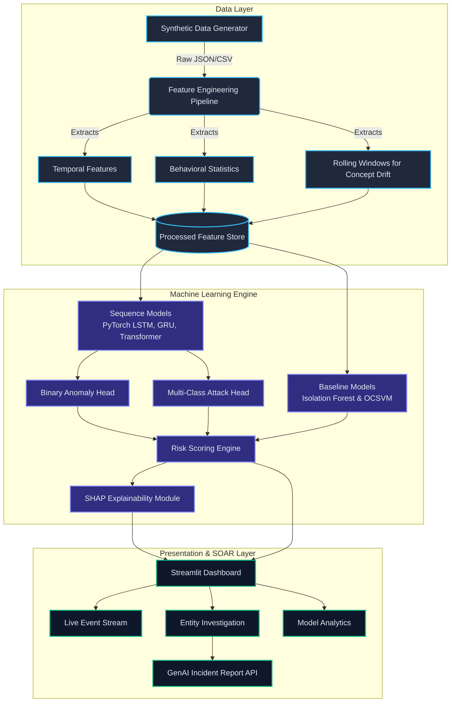

# SentinAI Architecture Diagram

```mermaid
graph TD
    %% Define Styles
    classDef datafill fill:#1e293b,stroke:#38bdf8,stroke-width:2px,color:#e2e8f0;
    classDef modelfill fill:#312e81,stroke:#818cf8,stroke-width:2px,color:#e2e8f0;
    classDef uifill fill:#0f172a,stroke:#10b981,stroke-width:2px,color:#e2e8f0;

    %% Data Ingestion & Engineering Layer
    subgraph "Data Layer"
    A[Synthetic Data Generator] -->|Raw JSON/CSV| B(Feature Engineering Pipeline)
    B -->|Extracts| C1[Temporal Features]
    B -->|Extracts| C2[Behavioral Statistics]
    B -->|Extracts| C3[Rolling Windows for Concept Drift]
    C1 --> D[(Processed Feature Store)]
    C2 --> D
    C3 --> D
    end
    
    class A,B,C1,C2,C3,D datafill;

    %% ML Modeling Layer
    subgraph "Machine Learning Engine"
    D --> E1[Baseline Models<br>Isolation Forest & OCSVM]
    D --> E2[Sequence Models<br>PyTorch LSTM, GRU, Transformer]
    
    E2 --> F1[Binary Anomaly Head]
    E2 --> F2[Multi-Class Attack Head]
    
    F1 --> G[Risk Scoring Engine]
    F2 --> G
    E1 --> G
    
    G --> H[SHAP Explainability Module]
    end
    
    class E1,E2,F1,F2,G,H modelfill;

    %% UI & Response Layer
    subgraph "Presentation & SOAR Layer"
    H --> I[Streamlit Dashboard]
    G --> I
    
    I --> J1[Live Event Stream]
    I --> J2[Entity Investigation]
    I --> J3[Model Analytics]
    
    J2 --> K[GenAI Incident Report API]
    end
    
    class I,J1,J2,J3,K uifill;
```
